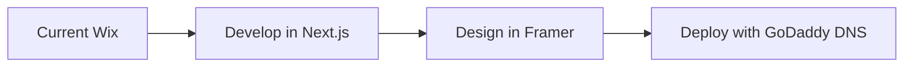

# TD Studios NY Deployment Guide

## 🚀 Repository Setup Complete

**GitHub Repository:** https://github.com/tdiorio2323/tdstudiosny  
**Status:** ✅ Ready for development and deployment

## 📋 Development Workflow

### **Local Development**
```bash
# Navigate to project
cd /Users/tylerdiorio/Projects/tdstudiosny

# Install dependencies (if needed)
npm install

# Start development server
npm run dev

# Open in browser: http://localhost:3000
```

### **Git Workflow**
```bash
# Make changes to your code
# Stage changes
git add .

# Commit changes
git commit -m "Add: your feature description"

# Push to GitHub
git push origin main
```

## 🎯 Migration Path: Wix → Framer → GoDaddy Domain

### **Phase 1: Development (Current)**
- ✅ GitHub repo created and ready
- ✅ Next.js project optimized with TD Studios core
- ✅ Local development environment set up

### **Phase 2: Framer Migration**
When you're ready to migrate from Wix to Framer:

#### **Option A: Export Components to Framer**
```bash
# Build production version
npm run build

# Export components for Framer
# (Components can be recreated in Framer based on this codebase)
```

#### **Option B: Deploy Next.js then Migrate**
```bash
# Deploy to Vercel first for testing
vercel --prod

# Then migrate design elements to Framer
# Finally point GoDaddy DNS to Framer
```

### **Phase 3: GoDaddy Domain Setup**

#### **DNS Configuration for Framer**
1. **Login to GoDaddy DNS Management**
2. **Add CNAME Records:**
   ```
   CNAME: www -> framer.website
   A Record: @ -> 76.76.21.93 (Framer's IP)
   ```

#### **Alternative: Vercel Deployment**
If you prefer Next.js over Framer:
1. **Deploy to Vercel**
2. **GoDaddy DNS Setup:**
   ```
   CNAME: www -> cname.vercel-dns.com
   A Record: @ -> 76.76.19.88 (Vercel's IP)
   ```

## 🛠️ Current Project Features

### **Optimized Architecture**
- Next.js 15 with App Router
- TypeScript for type safety  
- Tailwind CSS for styling
- Shared @td-studios/core utilities
- Production-ready configuration

### **Performance Features**
- Bundle size optimization
- Lazy loading components
- SEO optimization ready
- Mobile responsive design

### **Development Features**
- Hot reload development server
- ESLint for code quality
- TypeScript error checking
- Git hooks for consistency

## 📂 Project Structure
```
tdstudiosny/
├── app/                 # Next.js app directory
│   ├── components/      # React components
│   ├── lib/            # Utilities (shared from core)
│   ├── layout.tsx      # Root layout
│   └── page.tsx        # Homepage
├── public/             # Static assets
├── .env.local          # Environment variables
├── vercel.json         # Deployment configuration
├── CLAUDE.md           # Project context
├── DEPLOYMENT_GUIDE.md # This file
└── README.md           # Project documentation
```

## 🔄 Recommended Development Flow

### **1. Build Features Locally**
- Use the GitHub repo for version control
- Develop features with Next.js
- Test locally with `npm run dev`

### **2. Design Integration**
- Create components that can be easily recreated in Framer
- Use consistent design tokens and spacing
- Keep components modular for easy migration

### **3. Migration Strategy**


## 📝 Next Steps

### **Immediate (This Week)**
1. ✅ Repository setup complete
2. 🔄 Begin development of key pages
3. 🔄 Create component library
4. 🔄 Set up content structure

### **Short Term (2-4 Weeks)**
- Complete homepage design
- Build service pages
- Create contact forms
- Optimize for SEO

### **Migration (When Ready)**
- Export/recreate design in Framer
- Test with staging domain
- Update GoDaddy DNS
- Go live!

## 🚨 Important Notes

- **Keep development active** in this GitHub repo
- **Maintain version control** for all changes
- **Test locally** before any migration
- **Backup current Wix site** before DNS changes
- **Consider staging environment** for testing

---

**Repository URL:** https://github.com/tdiorio2323/tdstudiosny  
**Ready for development!** 🎉